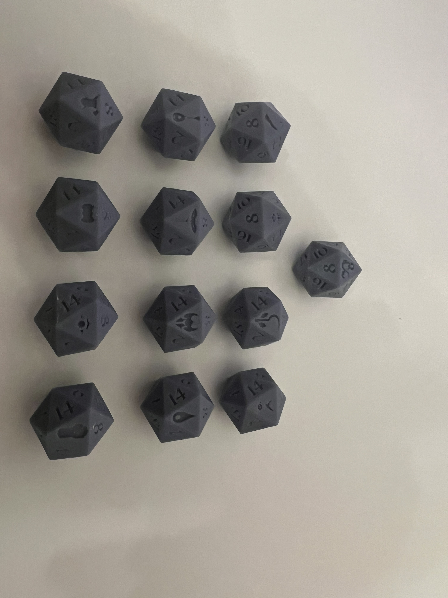

# DnDClassDiceGenerator

A generator for DnD class specific dice.

Each die is a regular D20 with the 20 character replaced with each class symbol. 
There is one die for each of the base classes: Barbarian, Bard, Cleric, Druid, Fighter, Monk, Paladin, Ranger, Rogue, Sorcerer, Warlock, and Wizard. There is also an additional one for the DnD logo.

This project was forked from [PolyDiceGenerator](https://github.com/charmaur/PolyDiceGenerator). This is an awesome project and you should check it out!

## Dependencies

This project requires that you have openscad already installed on your machine. If you don't you can download it from [their website](https://openscad.org/).

You will also need to install the required fonts. They are all located in the `fonts` directory. The exact way you install fonts will depend on your operating system. 

For windows you will need to install them for all users. To do this, right click and select `Install for all users`. 

For Ubuntu/linux/wsl users you just need to copy the font files into `/usr/share/fonts` and run `sudo fc-cache -f -v` or restart your computer.

## Using the script

Once you have the dependencies installed, all you need to do is run `build.sh`.

This script will generate a stl file for each of the DnD classes.

Note that the script will take a while to run.

## Getting the files
After you run the script the files will be in `build/$version/`. There is also a pre-build version of each file in there if you dont want to build it yourself.

## Modifications

I would love it if you want to make tweaks to this to make something unique!

The font used for the numbers on the dice is `fonts/Luminari-Regular.ttf`. You can swap this out for any other font you'd like.

The font used for the class symbols is `fonts/MyDNDFont_all_classes.otf`. I used FontForge to put together the font in `font_src/MyDNDFont.sfd`.

The original vector svg files used in that font are in `svgs`

If you want to add a new die, youll need to modify a few things.
You'll need to add a new entry to `DnDClassDiceGenerator.json`. You can modify this file directly or add a new parameter set in openscad.
You'll need to add it to the `ALL_CLASSES` variable in `build.sh`.
